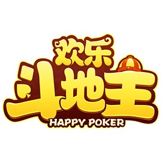
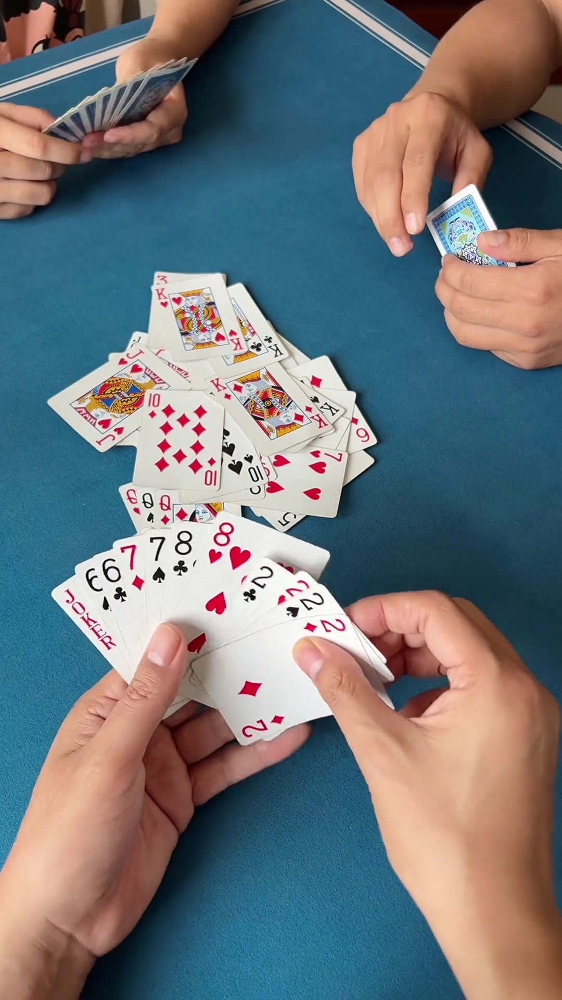

  

# Fight the landlord

CS181 Final Project 钱磊 张子豪 林子修 徐景骐

---

## Motivation

* Fight the landlord is a competitive card game with **adversarial decision-making**.
* It also has **team cooperation**, because two farmers play against one landlord.
* The game has **imperfect information**: players cannot see opponents' hands.
* The large action space makes it valuable for studying AI search and learning methods.

---

## Settings
### Problem Formulation / Environment Definition

* **Players:** 3 players: 1 landlord and 2 farmers.
* **Cards:** 54 cards, including two Jokers.
* **Goal:** Be the first side to play all cards.
* **State:** Player hand, public play history, current turn, and remaining card counts.
* **Action:** Any legal card combination that can be played.
* **Number of states:** Approximately $10^{83}$ possible states.

---

## GameRules
### Basic Rules

* **Card order:** Big Joker > Small Joker > 2 > A > K > Q > J > 10 > 9 > 8 > 7 > 6 > 5 > 4 > 3.
* Suits do not affect card strength.
* Each player receives **17 cards**.
* The remaining **3 bottom cards** are given to the landlord after bidding.
* The landlord plays alone with **20 cards**.
* The two farmers cooperate as one side.

---

## GameRules
### Advanced Combinations

* **Single:** one card, such as 7.
* **Pair:** two cards of the same rank, such as 8-8.
* **Triple:** three cards of the same rank, such as 5-5-5.
* **Triple with one:** three cards plus one extra card, such as 5-5-5 + 9.
* **Triple with pair:** three cards plus one pair, such as 5-5-5 + 9-9.
* **Straight:** consecutive single cards, such as 3-4-5-6-7.
* **Bomb:** four cards of the same rank.
* **Rocket:** Big Joker + Small Joker.

---

## GameRules
### Scores

* At the beginning, players bid **1, 2, or 3 points**.
* The highest bidder becomes the landlord.
* The bid is the base score.
* Each bomb doubles the score: $\times 2$.
* A rocket also doubles the score: $\times 2$.
* Final score = base score $\times$ all multipliers.

---

## Implementmethods
### 1. Adversarial Search

* **Minimax Algorithm**
  * Model the landlord and farmers as two opposing sides.
* **Depth-limited Adversarial Search**
  * Limit search depth to reduce computation.
* **Heuristic State Evaluation**
  * Evaluate hand strength, remaining cards, and possible control.
* **Expectimax Algorithm**
  * Consider uncertainty from hidden opponent cards.

---

## Implementmethods
### 2. CSP

* Use Constraint Satisfaction Problems to model legal card grouping.
* Find possible partitions of a hand into legal combinations.
* Prefer fewer groups and stronger combinations.
* Help the agent choose efficient card structures.

---

## Implementmethods
### 3. Inference

* **Exact Inference**
  * Track all played cards exactly.
  * Remove known cards from the unknown card pool.
* **Approximate Inference**
  * Estimate possible opponent hands.
  * Use sampling when exact calculation is too expensive.
  * Update beliefs from bidding and playing behavior.

---

## Implementmethods
### 4. MDP

* **Markov Decision Process (MDP)**
  * Define states, actions, transitions, and rewards.
* **State Value Function**
  * Estimate how good a game state is.
  * Use value estimates to guide move selection.

---

## Implementmethods
### 5. Reinforcement Learning

* **Q-Learning**
  * Learn action values through self-play.
* **ε-Greedy Policy**
  * Balance exploration and exploitation.
* **Policy Search**
  * Directly optimize the agent's playing strategy.

---

  

# Thank you

