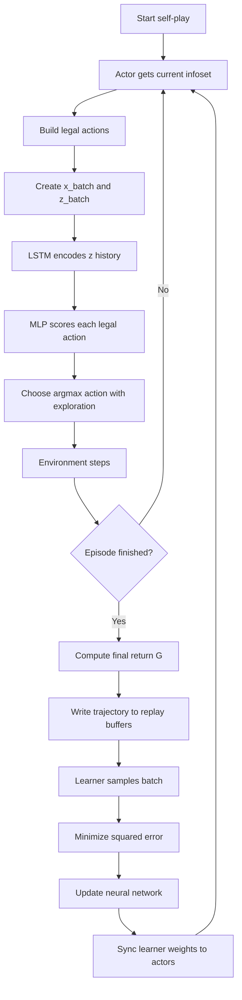
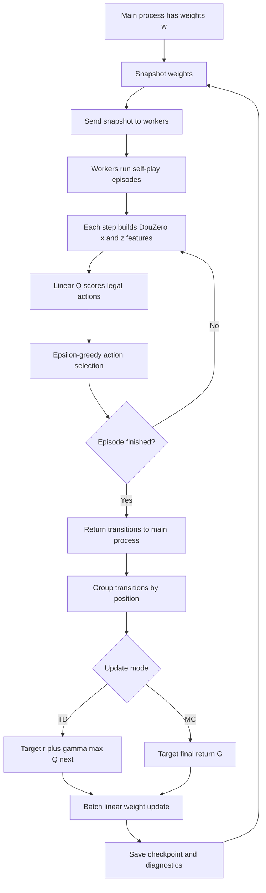

# Project Report: DouZero and ApproxDouFeature

本文档用简单方式解释两个系统：

- DouZero：原始深度 Monte Carlo 斗地主智能体。
- ApproxDouFeature：我们最新实现的线性近似 Q-learning，使用 DouZero 的原始特征。

## 1. DouZero 解释

### 1.1 核心思想

DouZero 的目标是学习一个动作价值函数：

```math
Q_\theta(s, a)
```

它表示：在状态 `s` 下选择动作 `a`，最后大概能得到多少回报。

DouZero 不直接枚举所有动作，而是只对当前合法动作逐个打分：

```math
a^* = \arg\max_{a \in A(s)} Q_\theta(s, a)
```

其中：

- `s` 是当前玩家能观察到的信息。
- `a` 是一个合法出牌动作。
- `A(s)` 是当前所有合法动作集合。
- `Q_theta(s, a)` 是神经网络输出的动作价值。

### 1.2 特征输入

DouZero 对每个候选动作构造两类输入：

- `x`：当前手牌、别人剩余牌数、最近动作、当前候选动作等。
- `z`：历史出牌序列，用 LSTM 处理。

代码中的维度大致是：

```text
landlord:
  x: 373
  z: 5 x 162

farmer:
  x: 484
  z: 5 x 162
```

其中 `z = 5 x 162` 表示最近历史动作被分成 5 组，每组 162 维。

### 1.3 网络结构

DouZero 的网络可以理解为：

```math
h = \mathrm{LSTM}(z)
```

```math
Q_\theta(s,a) = \mathrm{MLP}([h, x])
```

也就是：

1. 用 LSTM 编码历史出牌。
2. 把历史表示 `h` 和当前动作特征 `x` 拼接。
3. 用多层 MLP 输出一个标量 Q 值。

### 1.4 训练目标

DouZero 使用 Monte Carlo 终局回报作为训练目标。

一局结束后，得到终局回报：

```math
G =
\begin{cases}
R, & \text{landlord wins} \\
-R, & \text{landlord loses}
\end{cases}
```

对地主模型：

```math
y_t = G
```

对农民模型：

```math
y_t = -G
```

损失函数是均方误差：

```math
L(\theta)
=
\frac{1}{N}
\sum_{i=1}^{N}
\left(
Q_\theta(s_i, a_i) - y_i
\right)^2
```

然后用 RMSProp 更新神经网络参数：

```math
\theta
\leftarrow
\theta
-
\eta
\nabla_\theta L(\theta)
```

### 1.5 DouZero 流程图



### 1.6 为什么 DouZero 的 MC 能工作

DouZero 虽然也用终局回报，但它有几个稳定因素：

- 神经网络容量大，可以表达复杂状态和动作关系。
- LSTM 能利用历史出牌信息。
- 有 actor 和 learner 分离，数据通过 buffer 批量训练。
- 用 mini-batch 和 RMSProp，比单步线性更新稳定。
- 三个位置分别有模型，地主和农民不会共用同一套参数。

## 2. 最新 ApproxDouFeature 解释

### 2.1 核心思想

ApproxDouFeature 是我们写的线性近似 Q-learning。

它和 DouZero 使用相同的原始特征，但不用神经网络，而是用线性函数：

```math
Q_w(s,a)
=
w_p^\top \phi(s,a)
```

其中：

- `p` 是位置：`landlord`、`landlord_up`、`landlord_down`。
- `w_p` 是该位置的一组线性权重。
- `phi(s,a)` 是 DouZero 原始特征展开后的向量。

动作选择是 epsilon-greedy：

```math
a =
\begin{cases}
\text{random action}, & \text{with probability } \epsilon \\
\arg\max_{a \in A(s)} Q_w(s,a), & \text{otherwise}
\end{cases}
```

### 2.2 特征设计

ApproxDouFeature 直接复用 DouZero 的 `x_batch` 和 `z_batch`：

```math
\phi(s,a)
=
[x(s,a), \mathrm{flatten}(z(s))]
```

维度是：

```text
landlord:
  x = 373
  z = 5 x 162 = 810
  total = 1183

landlord_up:
  x = 484
  z = 810
  total = 1294

landlord_down:
  x = 484
  z = 810
  total = 1294
```

所以一共有三套权重：

```math
w_{\text{landlord}} \in \mathbb{R}^{1183}
```

```math
w_{\text{landlord\_up}} \in \mathbb{R}^{1294}
```

```math
w_{\text{landlord\_down}} \in \mathbb{R}^{1294}
```

总权重数量是：

```math
1183 + 1294 + 1294 = 3771
```

### 2.3 TD 更新模式

TD 模式每次玩家再次行动时，更新上一次动作。

TD target 是：

```math
y_t
=
r_t
+
\gamma
\max_{a'} Q_w(s_{t+1}, a')
```

TD error 是：

```math
\delta_t
=
y_t
-
Q_w(s_t, a_t)
```

线性权重更新是：

```math
w_p
\leftarrow
w_p
+
\alpha
\left(
\delta_t \phi(s_t,a_t)
-
\lambda w_p
\right)
```

其中：

- `alpha` 是学习率。
- `gamma` 是折扣因子。
- `lambda` 是 L2 正则系数。

### 2.4 Monte Carlo 更新模式

MC 模式不在中间更新，而是在一局结束后，把终局回报回填给本局所有动作。

终局回报：

```math
G =
\begin{cases}
R, & \text{this position wins} \\
-R, & \text{this position loses}
\end{cases}
```

MC target 是：

```math
y_t = G
```

误差是：

```math
\delta_t
=
G
-
Q_w(s_t,a_t)
```

权重更新仍然是：

```math
w_p
\leftarrow
w_p
+
\alpha
\left(
\delta_t \phi(s_t,a_t)
-
\lambda w_p
\right)
```

### 2.5 并行训练方式

ApproxDouFeature 使用同步并行采样：

1. 主进程复制当前权重。
2. 多个 worker 用这份权重并行打牌。
3. worker 返回 transitions。
4. 主进程合并 transitions。
5. 主进程按位置 batch 更新权重。
6. 下一轮 worker 使用新权重继续采样。

它不是 DouZero 那种 actor-learner replay buffer 架构。

### 2.6 ApproxDouFeature 流程图



### 2.7 当前实验现象

当前 `td_1m` 和 `mc_1m` 的结果差异很大：

```text
td_1m:
  landlord win rate 最终约 0.607

mc_1m:
  landlord win rate 一直是 0
```

这说明：

- TD 版本能学到一些地主策略。
- MC 版本在我们的线性模型里发生了策略坍缩。

主要原因是：

- MC 把同一个终局输赢回填给一局里所有动作。
- 线性模型表达能力弱，容易把常见状态特征整体压坏。
- 没有 replay buffer 和 baseline，坏策略会迅速影响下一批数据。
- 地主本身更难，负回报会更强地压低地主动作价值。

### 2.8 DouZero 和 ApproxDouFeature 的关键区别

| 项目 | DouZero | ApproxDouFeature |
|---|---|---|
| 特征 | x_batch + z_batch | x_batch + flatten z_batch |
| 模型 | LSTM + MLP | 线性函数 |
| Q 函数 | `Q_theta(s,a)` | `w^T phi(s,a)` |
| 更新 | MC 回报监督学习 | TD 或 MC 线性更新 |
| 优化器 | RMSProp | 手写线性梯度更新 |
| 并行 | actor + buffer + learner | worker 同步采样 + 主进程更新 |
| 稳定性 | 较强 | TD 可用，MC 容易坍缩 |
| 可解释性 | 较弱 | 较强，可以看每个特征权重 |

## 3. 一句话总结

DouZero 是：

```text
DouZero features + LSTM/MLP + Monte Carlo target + buffer batch learning
```

ApproxDouFeature 是：

```text
DouZero features + linear Q function + TD/MC update + feature diagnostics
```

两者最大的区别不是特征，而是模型容量和训练稳定机制。

